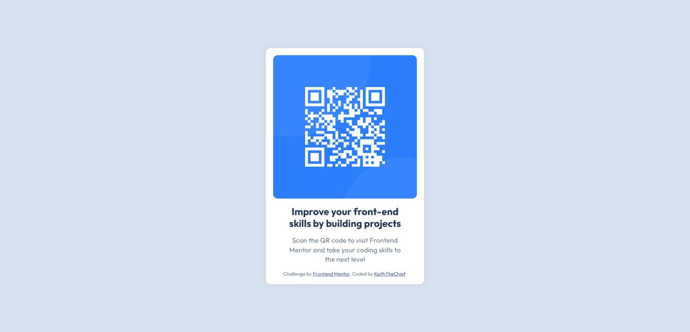

# Frontend Mentor - QR code component solution

This is a solution to the [QR code component challenge on Frontend Mentor](https://www.frontendmentor.io/challenges/qr-code-component-iux_sIO_H). Frontend Mentor challenges help you improve your coding skills by building realistic projects. 

## Table of contents

- [Overview](#overview)
  - [Screenshot](#screenshot)
  - [Links](#links)
- [My process](#my-process)
  - [Built with](#built-with)
  - [What I learned](#what-i-learned)
  - [Continued development](#continued-development)
  - [Useful resources](#useful-resources)
- [Author](#author)

## Overview

This is my solution for the [QR code component](https://www.frontendmentor.io/challenges/qr-code-component-iux_sIO_H) challenge as a part of the [Getting started on Frontend Mentor](https://www.frontendmentor.io/learning-paths/getting-started-on-frontend-mentor-XJhRWRREZd) learning path.

### Screenshot



### Links

- Solution URL: [https://www.frontendmentor.io/solutions/qr-code-page-using-flexbox-2gcZFrrgXq](https://www.frontendmentor.io/solutions/qr-code-page-using-flexbox-2gcZFrrgXq)
- Live Site URL: [https://keiththechief.github.io/qr-code-frontend-mentor/](https://keiththechief.github.io/qr-code-frontend-mentor/)

## My process

### Built with

- Visual Studio Code
- Semantic HTML5 markup
- CSS custom properties
- Flexbox
- Mobile-first workflow

### What I learned

This project helped me better understand how to morph and position images when using CSS and how to scale the project using media queries in order for all of its content to fit onto mobile devices. Below is the code I used to get these results.

```css
img {
  display: block;
  width: 320px;
  border-radius: 10px;
}

@media only screen and (max-width: 600px) {
  h1 {
    font-size: 15px;
  }

  p {
    font-size: 12px;
  }
  
  img {
    width: 225px;
  }
  
  .container {
    width: 225px;
  }
}
```

### Continued development

Even though I have a basic understanding of writing HTML and CSS, (I also plan on learning JavaScript) I'm fairly new on trying to write projects on my own. I hope to use FrontendMentor's resources to get a better grasp on writing a website in order to better optimize the amount of code needed. I plan on getting to a point where I don't have to rely on other means to write a website.

### Useful resources

- [Hackr Business Card project](https://hackr.io/blog/how-to-create-a-html-animated-business-card) - I mainly used this as a reference in order to make the card-like design that was presented in the previews.

I also used the Figma files that were given to try and match the final project as closely as possible. Usually you would need a PRO membership for Figma file use but this particular challenge included them as a trial use.

## Author

- Frontend Mentor - [@KeithTheChief](https://www.frontendmentor.io/profile/KeithTheChief)
- Twitter - [@Keith_TheChief](https://www.twitter.com/keith_thechief)